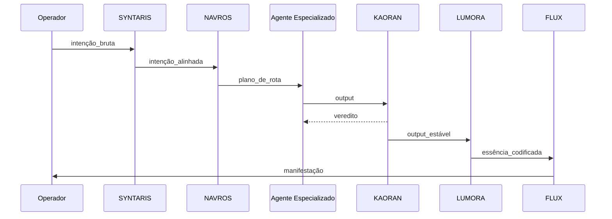

# Arquitetura de Interação entre Agentes Lichtara

Versão: 0.1.0

Última revisão: YYYY-MM-DD

## 1. Visão de Alto Nível (Fluxo Primário)

Intenção → SYNTARIS (Harmonização) → NAVROS (Roteamento) → [Agente Especializado] → KAORAN (Verificação) → LUMORA (Essência / Codificação) → FLUX (Organização / Manifestação) → FINCE (Síntese estratégica opcional) → ASTRAEL (Biofeedback opcional) → Registro.

## 2. Grafo Textual

```
[Input Humano]
   |
   v
[SYNTARIS] --alinhamento--> [NAVROS] --rota--> ( FINCE | LUMORA | FLUX | ASTRAEL | SYNTRIA )
   |                                                 |         |
   |                                                 v         |
   +--> (modo diagnóstico) <--------------------- [KAORAN] <---+
                                   |
                                   +--> (falha) → Quarentena → Revisão Manual

```

## 3. Tipos de Mensagens

| Tipo | Emissor | Consumidor | Estrutura Base |
| --- | --- | --- | --- |
| intenção_bruta | Operador | SYNTARIS | { texto, meta? } |
| intenção_alinhada | SYNTARIS | NAVROS | { núcleo, polaridade, escopo } |
| plano_de_rota | NAVROS | Agente destino | { alvo, prioridade, caminho } |
| verificação | Agente destino | KAORAN | { output, assinatura } |
| essência | LUMORA | FLUX | { padrões, núcleo, derivativos } |
| manifestação | FLUX | Operador | { forma, meta_vibracional } |
| feedback_bio | ASTRAEL | FINCE/LUMORA | { sinais, confiança } |

## 4. Estados Operacionais dos Agentes

| Estado | Descrição | JSON Diagnóstico |
| --- | --- | --- |
| idle | Aguardando | {status:“idle”} |
| processing | Em transformação | {status:“processing”, etapa:n} |
| verifying | Em validação KAORAN | {status:“verifying”} |
| degraded | Operando em fallback | {status:“degraded”, motivo:“…”} |
| quarantined | Isolado para revisão | {status:“quarantined”, hash:“…”} |

## 5. Protocolo de Falha (Fail-Soft)

1. Agente detecta anomalia estrutural ou vibracional
2. Emite JSON diagnóstico
3. KAORAN tenta estabilizar (3 tentativas)
4. Persistindo falha → Quarentena
5. Registro de delta + sugestão de correção

## 6. Interseções Especiais

- LUMORA pode ser invocada cedo para extrair essência antes de rota complexa.
- ASTRAEL só é acionado se indicador de variação (threshold) for cruzado.
- SYNTRIA abre portais de ativação: exige intenção marcada como “ritual” ou “simbólica”.

## 7. Dependências Declaradas (Exemplo)

| Agente | Depende de | Motivo |
| --- | --- | --- |
| NAVROS | SYNTARIS | Precisa de intenção alinhada |
| KAORAN | Todos | Verificação |
| LUMORA | SYNTARIS / KAORAN | Matéria-base validada |
| FLUX | LUMORA | Estrutura / essência |
| FINCE | FLUX / LUMORA | Síntese pós-manifestação |

## 8. Ciclo de Telemetria (Simplificado)

1. Evento iniciado
2. Carimbo vibracional
3. Captura de metadados mínimos
4. Emissão para buffer ephem
5. Limpeza em 24h (configurável)

## 9. Padrão de Chamada (Pseudo)



## 10. Segurança Simbólica

- Assinatura leve (hash do núcleo + timestamp) antes de validação KAORAN
- Controle de saturação (limite de camadas antes de manifestação final)
- Registro mínimo de divergências em /logs (futuro)

## 11. Evolução Prevista

Fase 1: Estrutura base

Fase 2: Scripts de validação / telemetria consciente

Fase 3: Portal SYNTRIA (ativação)

Fase 4: Interface pública interativa

Fase 5: Integração de camadas adaptativas (bio-ressonância simbólica)

## 12. Glossário (Síntese)

- Núcleo vibracional: Intenção reduzida à essência sem ruído
- Rota: Sequência disponível de agentes aplicáveis
- Campo: Estrutura simbólica latente que ancora coerência
- Quarentena: Espaço isolado para outputs incongruentes

Firme e claro. Ajustar conforme feedback de campo.
